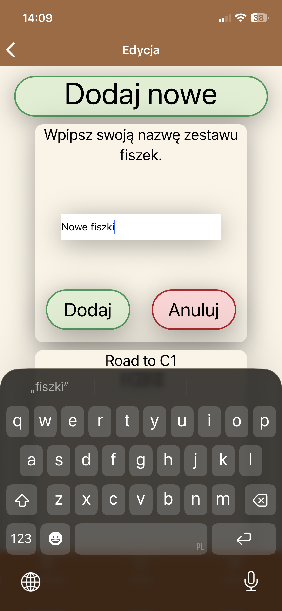
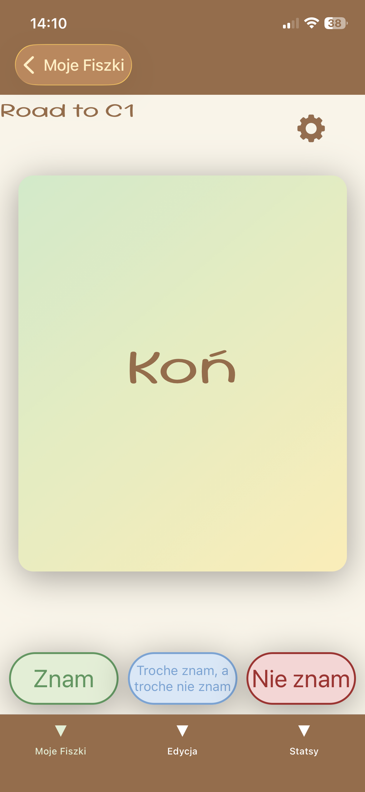
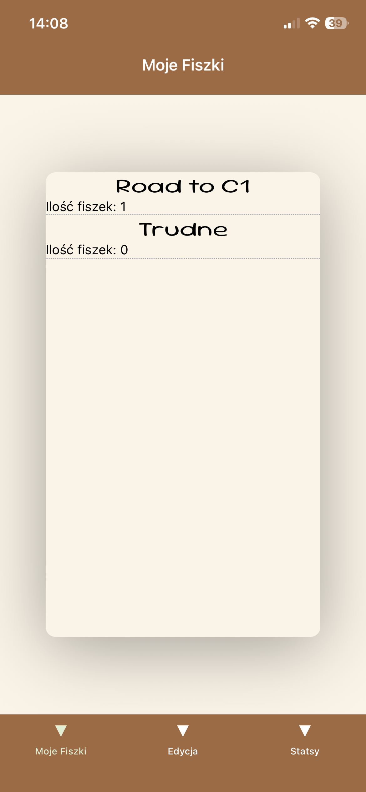

# 📚 Fiszki App

Aplikacja mobilna do nauki języków obcych i zarządzania własną bazą fiszek. Projekt stworzony, aby pomóc w systematycznej nauce poprzez algorytm powtórek.


## 📱 Zrzuty ekranu

<p align="center">
  
  
  
  
</p>

## 🚀 Główne funkcjonalności

- **System powtórek:** Algorytm ważący słowa ("Znam", "Trochę znam", "Nie znam") i dostosowujący częstotliwość ich wyświetlania.
- **Zarządzanie bazą:** Dodawanie, edycja i usuwanie fiszek oraz kategorii.
- **Interaktywny UI:** Animowane odwracanie kart (React Native Reanimated).
- **Wielojęzyczność:** Możliwość nauki w trybie PL -> EN, EN -> PL lub losowym.
- **Persystencja danych:** Zapisywanie postępów i bazy w pamięci urządzenia (AsyncStorage).

## 👀 Co w najbliższej przyszłości

- **Statystyki:** Przyjazne dla oka statystyki uprzyjemniające naukę
- **Synchronizacja:** Synchronizacja danych z chmura za pomocą Firebase
- **Udostępnianie:** Udostępnianie fiszek za pomoca generowanego kodu
- **Wielojęzyczność:** Przetłumaczenie aplikacji na wiele języków
- **Mikropłatności:** Udostępnienie płatnych skórek
- **Wymowa:** Zamiana tekstu angielskiego na mowę

## 🛠️ Technologie

Projekt został zbudowany z użyciem nowoczesnego stacku technologicznego:

- **Core:** React Native, Expo
- **Język:** TypeScript
- **Stylowanie:** NativeWind (TailwindCSS)
- **Nawigacja:** React Navigation
- **Animacje:** React Native Reanimated
- **Zarządzanie stanem:** Context API (Custom Hooks)

## 💡 Czego się nauczyłem?

Podczas tworzenia tej aplikacji zmierzyłem się z wieloma wyzwaniami:

1.  **Zarządzanie stanem:** Początkowo używałem lokalnych stanów i `prop drilling`, co prowadziło do problemów. Przepisałem aplikację na **Global Context API**, co uporządkowało przepływ danych.
2.  **Optymalizacja renderowania:** Zrozumiałem działanie `useEffect` i `useCallback` oraz nauczyłem się unikać infinite loops przy aktualizacji stanu.
3.  **Architektura:** Wdrożyłem wzorzec Immutable Update przy edycji złożonych struktur danych.
4.  **Git:** Nauczyłem się zarządzać historią zmian i pracować z `.gitignore`.

## ⚙️ Instalacja i uruchomienie

1. Sklonuj repozytorium:
   ```bash
   git clone [https://github.com/damiangarasz/fiszki.git](https://github.com/damiangarasz/fiszki.git)
   ```
2. Lub dołącz do grona testerów: [https://play.google.com/apps/internaltest/4701472644857898973](https://play.google.com/apps/internaltest/4701472644857898973)
